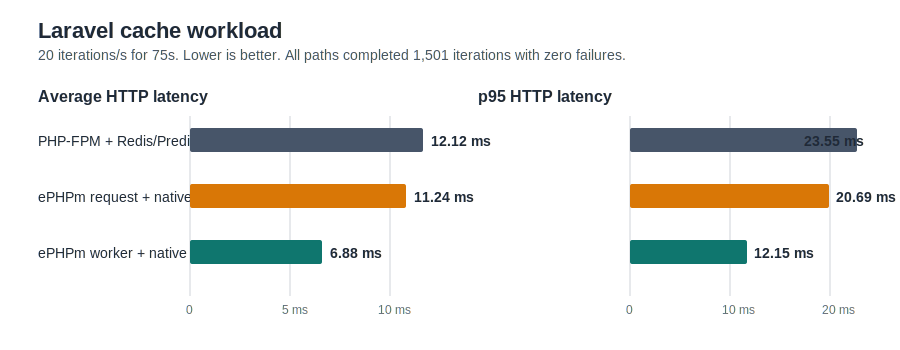
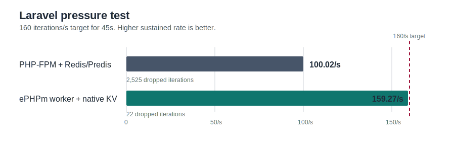
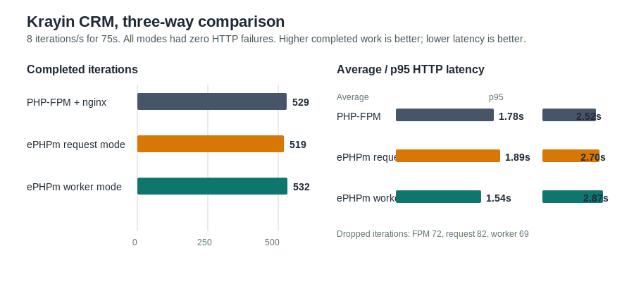
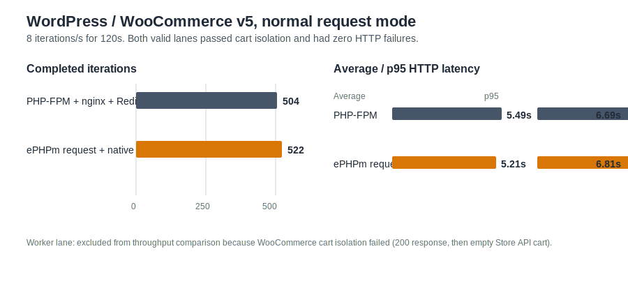
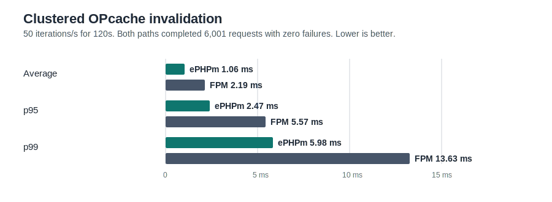

# ePHPm Lab

Author: Benjamin Pace

A reproducible Kubernetes lab for people deciding whether ePHPm belongs in their PHP deployment. It compares the published `ephpm/ephpm:v0.4.2-php8.4` image with the official PHP 8.4 FPM image and nginx across small scripts, synthetic apps, Krayin CRM, Laravel, Redis/Predis, ePHPm native KV, worker mode, and clustered OPcache invalidation.

> This is not "ePHPm beats PHP-FPM." It is "ePHPm can beat PHP-FPM when the app and deployment model are adapted to ePHPm's worker/native-service architecture."

## The Numbers

### Laravel Cache Workload

At `20 iterations/s` for `75s`, the persistent ePHPm worker plus native KV was the fastest path for average, median, and p95 latency. The short run also produced a worse p99 than request mode, so the chart should be read as a strong signal, not a promise about every tail percentile.

### Medium-Traffic Pressure Test

At `160 iterations/s` for `45s`, ePHPm worker mode stayed close to the target rate while PHP-FPM plus Redis/Predis could only sustain about 100 iterations/s. Both runs had zero HTTP failures; the visible difference is scheduled work that could not start in time.

### Krayin CRM, Three Ways

Krayin is the useful reality check. In a real Laravel CRM at `8 iterations/s` for `75s`, ePHPm request mode was slightly behind PHP-FPM. Adding the Octane-style ePHPm worker changed the result: it completed the most work and had the lowest average latency, while PHP-FPM retained the best p95 and p99.

### WordPress / WooCommerce v5

The first account-free, plugin-heavy WordPress fixture put the two valid normal request paths very close together. At `8 iterations/s` for `120s`, ePHPm request mode completed `522` browse iterations to PHP-FPM/nginx with Redis's `504`, with lower average/median latency; PHP-FPM held the slightly better p95. Both had zero HTTP failures and passed the two-user WooCommerce cart-isolation gate.

ePHPm's WordPress worker lane was not included in that throughput chart. The initial worker adapter skipped WooCommerce's `wp_loaded` add-to-cart handler; the upstream `v0.1.1` lifecycle fix then exposed an Elementor class-redeclaration fatal on this plugin-heavy fixture before the cart gate could run. Both are functional blockers, not performance results. The [follow-up investigation](docs/wordpress-worker-investigation.md) has the trace and retest evidence.

### Clustered OPcache Invalidation

One `ephpm deploy` invalidated OPcache across two ePHPm pods without rolling PHP processes. The PHP-FPM comparison used a rolling restart, which remained available but took longer at every recorded latency percentile.

## Match Your App

| Your deployment shape | What this lab says | Why |
| --- | --- | --- |
| Arbitrary PHP app as a drop-in replacement | Start with PHP-FPM | ePHPm request mode is not a universal performance win. |
| Laravel or another framework in normal request mode | Test both | Krayin request mode favored FPM; the synthetic Laravel request path was competitive. |
| Persistent Laravel / Octane-style worker | Worth serious testing | Worker mode improved Krayin and won the Laravel cache workload. |
| Plugin-heavy WordPress/WooCommerce in normal request mode | Test both, expect a close result | The v5 store fixture gave ePHPm request mode a small average-latency edge and PHP-FPM a slightly better p95. |
| WooCommerce storefront in ePHPm worker mode (`v0.4.0`) | Do not use without a workflow-specific validation | The v5 cart-isolation gate failed despite `200` responses. |
| Cache-heavy hot paths that can use native ePHPm KV | Strongest ePHPm case | Avoiding the FPM-to-Redis/Predis path produced the clearest advantage. |
| Clustered app with deploy-time OPcache invalidation | Strong ePHPm operational case | One deploy signal invalidated the cluster without a PHP process rollout. |
| Need maximum production familiarity today | PHP-FPM remains king | Extension expectations, documentation, and operator experience still matter. |

## Benchmark Map

| Test | Workload | Compared shapes | Result |
| --- | --- | --- | --- |
| v1 | Tiny PHP routes | PHP-FPM/nginx vs ePHPm request | ePHPm won average latency; too small to drive a platform decision. |
| v2 | Synthetic front controller | PHP-FPM/nginx vs ePHPm request | ePHPm won average and p95. |
| v3 | Krayin CRM request mode | PHP-FPM/nginx vs ePHPm request | PHP-FPM won. |
| v3b | Krayin CRM worker mode | PHP-FPM/nginx vs ePHPm request vs ePHPm worker | Worker led completed work and average latency; FPM had the best p95/p99. |
| v4 | Cache-heavy Laravel | FPM/Redis/Predis vs ePHPm request/native KV vs ePHPm worker/native KV | Worker mode won average, median, and p95 at the baseline rate. |
| v4 pressure | Same Laravel workload | FPM/Redis/Predis vs ePHPm worker/native KV | ePHPm worker held `159.27/s` of a `160/s` target; FPM held `100.02/s`. |
| OPcache | Two-pod deploy invalidation | ePHPm deploy vs FPM rolling restart | ePHPm won latency and avoided rolling PHP processes. |
| v5 | Plugin-heavy WordPress/WooCommerce browse | FPM/nginx/phpredis/Redis vs ePHPm request/native KV | Very close normal-request result: ePHPm had better mean/median and completion; FPM had slightly better p95. |
| v5 worker gate | WooCommerce cart session | ePHPm WordPress worker/native KV | Blocked: `200` responses, but cart remained empty after `?add-to-cart=`. |

Raw data, workload details, and the original test narrative live in [the WordPress v5 report](docs/wordpress-v5.md), [the 0.4.0 retest report](docs/ephpm-0.4.0-retest.md), [the OPcache follow-up](docs/follow-up-opcache.md), and [the chronological lab report](docs/ephpm-vs-php-fpm-lab-report.md).

## Reproduce It

The manifests are plain Kubernetes YAML and the load generator is k6. Start with the [reproduction guide](docs/reproduction.md) for the exact sequence, then inspect the [manifest map](k8s/README.md) for the workload files.

## What Comes Next

- Re-run the WordPress worker lane after its WooCommerce cart/session handling is corrected, then add WordPress variations with an importer-generated catalog and a page-builder-heavy home page.
- Drupal, Symfony, and additional representative Laravel applications.
- PHP-FPM with `phpredis`, not only Predis/TCP.
- Larger nodes and Metrics API data so latency can be connected to CPU and memory behavior.
- Ten to thirty minute runs, multiple worker counts, and restart/failure testing for persistent workers.
- A direct Octane, Swoole, RoadRunner, and ePHPm comparison.

## Caveats

This is a reproducible lab, not a universal benchmark. The original environment was a three-node Linode LKE cluster using small `g6-standard-1` nodes, and Metrics API was not installed. The manifests generate applications in init containers, and the Krayin benchmark credentials are throwaway test-only credentials. The public repo intentionally omits kubeconfigs, tokens, local environment files, built images, and upstream source checkouts. See [the detailed retest environment](docs/ephpm-0.4.0-retest.md#environment) before applying these numbers to a production decision.

## Repository Layout

| Path | Purpose |
| --- | --- |
| `docs/` | Results, methodology, history, and reproduction instructions. |
| `docs/assets/` | Rendered comparison charts used by this README. |
| `k8s/` | Kubernetes manifests and k6 jobs for each benchmark phase. |
| `wordpress-v5/` | Account-free WordPress/WooCommerce fixture, seed scripts, and k6 probes. |
| `patches/` | Local patch retained from an older source-built worker-mode experiment. |
| `scripts/` | Helper scripts retained from earlier source-build experiments and v4 worker runs. |

## License

This lab repository is licensed under the MIT License, matching ePHPm.
