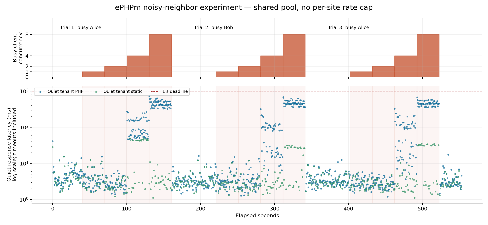
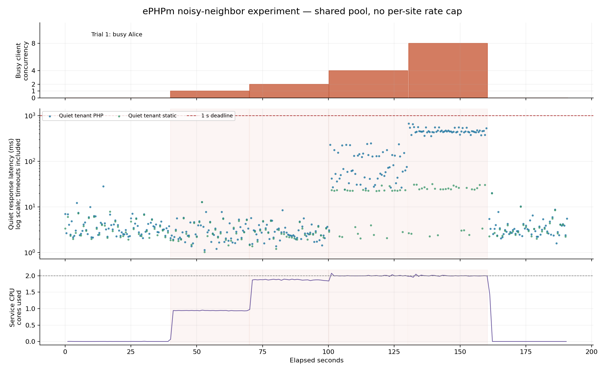

# Proof: a busy ePHPm tenant slows its neighbor

**Confirmed in the current shared-pool lab configuration:** eight concurrent CPU requests on one site increased the other site's PHP p95 latency by approximately **60–89×**, at an unchanged two requests/second. The quiet site recovered after the load stopped. The effect reproduced with the tenant roles reversed.

| Trial | Busy site | Quiet site baseline p95 | Under eight busy clients | Recovery p95 |
|---|---|---:|---:|---:|
| 1 | Alice | 10.2 ms | 610.8 ms | 6.1 ms |
| 2 | Bob | 9.6 ms | 627.3 ms | 8.1 ms |
| 3 | Alice | 6.4 ms | 572.5 ms | 6.8 ms |

**This demonstrated latency interference, not an outage.** All 1,080 measured quiet-tenant PHP requests completed successfully within the one-second deadline. Each phase contains 60 PHP observations. The p95 values are nearest-rank percentiles, not estimates of a production SLA.

## What was required

- A tenant able to deploy a normal PHP endpoint containing a fixed one-million-iteration SHA-256 loop.
- At most eight concurrent requests to that tenant, generated entirely inside the offline lab network.
- No filesystem escape, privilege escalation, shell execution, external network access, unbounded loop, or memory bomb.

The service was ePHPm v0.10.1 / PHP 8.4.23, with four PHP execution threads, a shared FIFO queue of 32, a 200% CPU quota and 2 GiB memory limit. The native multi-tenant security preset and eBPF policy stayed enabled. **The optional per-site rate cap and the preview preset were not enabled.** This proves the current configuration permits interference; it does not establish that documented controls cannot mitigate it.

## How the proof was controlled

The quiet tenant received two independently scheduled PHP requests/second throughout warm-up, baseline, each load step and recovery. A separate static request/second served as an HTTP control. The busy tenant stepped through 1, 2, 4 and 8 concurrent requests. Each step, baseline and recovery lasted 30 seconds. Trials alternated Alice/Bob, Bob/Alice and Alice/Bob.

The predeclared criterion was quiet-tenant p95 above both five times baseline and 250 ms, or more than 1% deadline failures. The eight-client step met the latency criterion in all three trials. Lower steps did not meet that criterion in these trials. The static control remained much faster than the quiet PHP route under the heaviest load; detailed values and scheduler lag are in the report.

The repeated load/recovery pattern supports cross-tenant resource contention as the explanation. It does not independently isolate CPU throttling from execution-pool/queue waiting, and the WSL host is not a dedicated production machine.

## Evidence and reproduction

- [Primary three-trial report](results/20260908T220856Z/REPORT.md)
- [Every HTTP request](results/20260908T220856Z/requests.jsonl)
- [Summary statistics](results/20260908T220856Z/summary.json)
- [Exact server configuration](results/20260908T220856Z/ephpm.toml)
- [Reproduction instructions](README.md)

The primary run's cgroup sampler could not see its files because `ip netns exec` changed the sysfs mount view. Its raw errors are preserved; no CPU claim is made from those missing samples. The launcher was corrected to use network-only `nsenter`, with a preflight requiring readable cgroup counters. HTTP request measurements were unaffected by that collection error.

### Additional trial with working CPU instrumentation

The [follow-up run](results/20260908T222017Z/REPORT.md) repeated the full baseline/pressure/recovery ladder once. Bob's p95 rose from **6.9 ms to 560.9 ms**, then recovered to **7.8 ms**, again with no deadline failures across 360 measured quiet PHP requests.

At eight busy clients the service consumed **2.00 CPU cores**, was throttled in **290 of 290 observed CPU periods**, and completed about **10.5 busy requests/second**. Peak memory in that phase was **60.5 MiB**. Baseline/recovery CPU consumption rounded to 0.00 cores. These measurements support CPU saturation as a contributor; they do not separate its effect from the shared PHP pool's queuing.

Both runs are retained separately. Across the primary and follow-up runs there were **zero quiet-tenant deadline failures among 1,440 measured PHP requests**. The service remained running after all pressure clients exited.

The next comparison should apply the documented per-site rate/burst controls to the same traffic and workload. Until that is measured, describe this as **cross-tenant latency interference in an uncapped shared PHP pool**, not a universal denial-of-service vulnerability in ePHPm.
